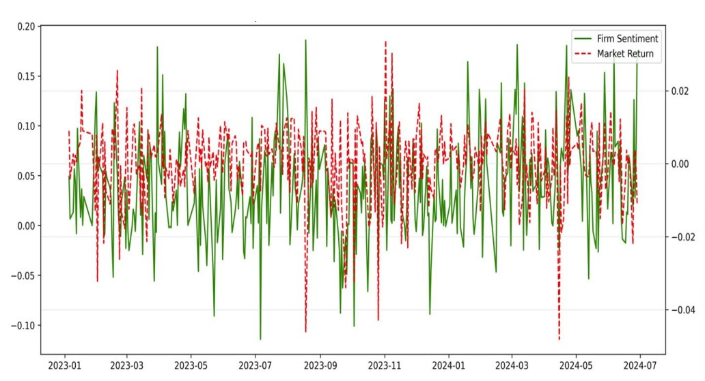

# Impact of News Sentiment on Stock Returns: Evidence from VN30

## Overview
This project investigates whether firm-specific news sentiment has statistically significant predictive power for short-term stock returns in the VN30 index. The project combines financial news collection, sentiment scoring, market data processing, and panel econometric modeling in Python and Jupyter Notebook.

## Research Objective
The study examines whether firm-specific sentiment provides additional explanatory power for short-term stock returns after controlling for market-wide movements and trading activity.

## Data
- Vietnamese financial news related to VN30 firms
- Macroeconomic news
- VN30 stock price and trading volume data
- Period: January 2023 to June 2024
- Final dataset: panel data of VN30 firms

## Workflow
1. Collect firm-level and macroeconomic financial news
2. Retrieve VN30 market data
3. Apply sentiment scoring
4. Merge text-based and structured market data
5. Estimate panel regression models and compare specifications

## Methods
- Python and Jupyter Notebook
- Data collection and preprocessing
- Sentiment scoring with Claude-assisted and PhoBERT-based logic
- Pooled OLS, Fixed Effects, and Random Effects models
- Model diagnostics including Hausman, Breusch–Pagan, VIF, and Durbin–Watson tests

## Sample Output

## Key Findings
- Firm-specific sentiment shows a positive and statistically significant relationship with short-term stock returns
- Market return remains the dominant driver of stock performance
- Macro sentiment is not statistically significant in the final model once market return is controlled for

## Repository Structure
- `notebooks/`: Jupyter Notebook used for data collection, merging, and model estimation
- `docs/`: final report and presentation slides
- `data/`: data note
- `outputs/`: selected charts or result outputs

## Note
This repository is intended as an academic project portfolio and highlights the workflow for data collection, panel-data modeling, and empirical interpretation in Python.
